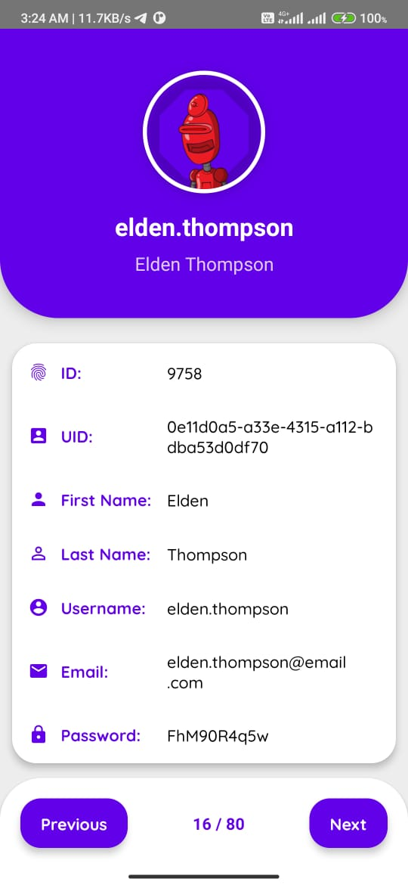

## User Information App

Overview

This React Native application displays user information fetched from a public API. It includes navigation buttons to view previous and next users and features a responsive layout with a focus on a clean and intuitive UI.

## Features

- Display user information with a responsive design
- Navigation buttons to cycle through users
- Error handling for failed API requests

## Project Structure

- **components**: Contains reusable UI components.
  - `ProfileHeader.js`: Displays user profile information.
  - `UserInformation.js`: Shows detailed user information.
  - `NavigationButtons.js`: Navigation buttons for cycling through users.
  - `UserInfoCard.js`: Displays user information in a card format.
- **services**: Contains API service functions.
  - `fetchUser.js`: Provides a function to fetch user data from the API.
- **screen**: Contains the main screen component.
  - `UserScreen.js`: Main screen displaying user data and handling navigation.
- **AppNavigator.js**: Configures the navigation stack.


## ScreeenShots



## Setup

1. Clone the repository:

   ```bash
   git clone <repository-url>
   ```

2. Navigate to the project directory:

   ```bash
   cd <project-directory>
   ```

3. Install dependencies:

   ```bash
   npm install
   ```

4. Run the app:

   ```bash
   npm start
   ```

   Follow the instructions provided by the React Native CLI to run the app on your emulator or device.

## Gradle Version

This project uses Gradle version 7.2.1. Ensure that you have the correct Gradle version installed.

## Troubleshooting

### Common Issues

- **Error Handling**: If an error occurs during API fetching, the app displays an error message and a retry button. Ensure your API endpoint is correct and that the server is running.

- **Navigation**: If the navigation buttons do not work as expected, check the user index bounds and make sure you are using valid indices.

## Contributing

If you would like to contribute to this project, please fork the repository and submit a pull request with your changes.

## License

This project is licensed under the MIT License. See the [LICENSE](LICENSE) file for details.
```

Feel free to modify any sections if needed!
